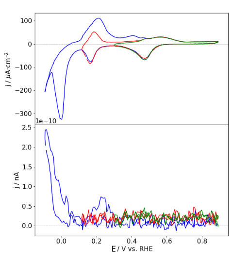
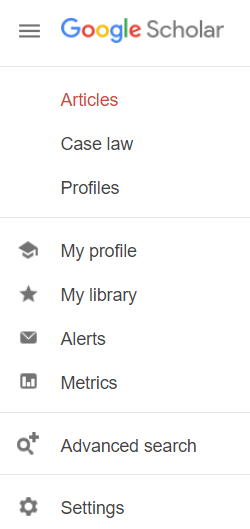
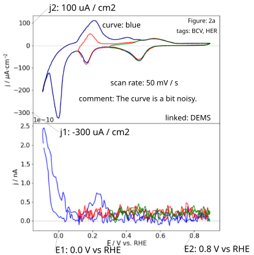

# Digitizing plots for echemdb

This step by step tutorial explains how to digitize plots commonly found in electrochemical research papers, e.g., cyclic voltammograms, for the [echemdb/website](https://github.com/echemdb/website) project. In this example a cyclic voltammogram is digitized. A plot is provided in Figure 2a in the {download}`publication example <./files/mustermann_2021_svgdigitizer_1/mustermann_2021_svgdigitizer_1.pdf>`.



To follow the step by step tutorial, some steps require an installation of the recent version of [svgdigitizer](https://github.com/echemdb/svgdigitizer) ([installation instructions](installation.md)).

Furthermore, the manipulation of SVG files is done with [Inkscape](https://inkscape.org/) (tested with V. 0.92 and V. 1.1).

## Step 1: Prepare PDF and BIB files

**1: Create a new directory:**

The directory should be named `FirstAuthorName_Year_FirstTitleWord_FirstPageNr`.

**Do not use capital letters.** For the example PDF this comes down to

`mustermann_2021_svgdigitizer_1`

The page number should be the page number in the published pdf. Since the example is not published the page number is `1`. In other cases this could be `1021`.

Put the publication PDF in the newly created directory. The PDF should be named according to the same scheme:

`mustermann_2021_svgdigitizer_1.pdf`

**2: Place a BIB file in the folder.**

A suggested approach is to search for the article with [Google Scholar](http://scholar.google.com/).

Modify the scholar settings so that a BibTeX link appears below the citation:

Click on the 3 lines next to the Google Scholar logo


Choose Settings



Select `Show links to import citations into BibTeX`


An `import into BibTeX` link appears below the linked article:


Download the bib file or save the content to a file named:

`mustermann_2021_svgdigitizer_1.bib`

Open the file and change the key, such that it matches the folder name:


Also fix any typos in the title.

**The folder should now contain the following files:**

`mustermann_2021_svgdigitizer_1.bib`

`mustermann_2021_svgdigitizer_1.pdf`

## Step 2: Prepare SVG and PNG files from the PDF

In a shell use `svgdigitizer paginate mustermann_2021_svgdigitizer_1.pdf` to create for each page of the PDF an `svg` and a `png` file in the same folder.

The filenames are of the form:

`mustermann_2021_svgdigitizer_1_p0.png`

`mustermann_2021_svgdigitizer_1_p0.svg`

**Note:** The page count starts from 0. It does not reflect the original page number in the PDF.

## Step 3: Digitize a plot

**1: Select an svg file with a plot to be digitized**

For this example, we use Inkscape to digitize some data in plot 2a in the PDF, which is located on page two of the manuscript (filename containing `_p1`). The plot contains three curves, which can be identified by their colors. Preferably each digitized curve should be placed in a single SVG file. Therefore, create a copy of the SVG file of page two (`mustermann_2021_svgdigitizer_1_p1.svg`) and rename it to`mustermann_2021_svgdigitizer_1_f2a_blue.svg` (`_p1` can be ommited since the figure can unambigusouly be identified by the figure label, e.g., `_f2a`). Here, `_f2a_blue` indicates that the digitized curve is in Fig. 2b and that the curve is blue. The identifier will later also be included in the SVG file.

 **2: Mark axis positions and labels**

In the SVG file, by marking two positions on each axis, both the units and the scale of the axis will be extracted.

In the example, the first position on the x-axis will be 0.0 V vs RHE. Add a text label that contains `E1: 0.0 V vs RHE`. Draw a line connecting the text label and the position on the x-axis. Finally **group** the **line** and the **text label**.

Repeat this for positions `E2`, `j1` and `j2`.

**Some notes on units and labels:**

* The `svgdigitizer.electrochemistry.cv.CV` module also accepts `U` (in units of V) on the x-axis and `I` (in units of A) on the y-axis.
* Units should be provided in the [astropy format](https://docs.astropy.org/en/stable/units/index.html). In brief:
  * [Standard units](https://docs.astropy.org/en/stable/units/standard_units.html) simply read: `V`, `A` or `m`.
  * Units can be preceeded by common prefixes, i.e., `mV`, `kV` or `uV`.
  * Note that $\mu$ is `u`.
  * fractions read as follows (note the spaces between the dashes): `mV / s`, `mA / cm2`.
  * For square, cubic, etc units simply add `2`, `3`, ... to the unit (see above).
  * Use parentheses if more than one unit is in the numerator or denominator, i.e., `(kg m) / s2`
* If the reference on the voltage axis is not given in the plot, extract this information from the manuscript text. Note that the reference scale given in the experimental section can be different to that in the main text of the manuscript.
* `svgdigitizer` only considers units in the labels for positions`E2`/`U2` and `j2`/`I2`.


When all axes have been marked, the plot looks as follows:


**3: Trace the curve**

1. Roughly trace the blue curve

Select the the tool `Draw Bezier curves`  and select the mode `Create regular Bezier path`. Try using as few nodes as possible. It is desired that a node is placed at maxima of sharp peaks. This way these features are not missed when using low sampling rates.


   

   Select the curve, select the tool `Edit paths by node`, and select all nodes by pressing `CTRL-a`. Click on the option `make selected nodes smooth`.

   Click on individual nodes and adjust the handles such that the path matches the curve in the plot. Eventually adjust the position of the nodes. Do this for each node until you are satisfied with the result.

   

2. Add a text field and name it `curve: identifier`, which in our case would be `curve: blue`.

3. Group the text field and the curve.


7. Add a text field to the plot containing the scan rate with which the data was acquired. This value is not necessarily given in the plot or figure description and might have to be extracted from the text of the manuscript. Here, `scan rate: 50 mV / s`. (mandatory for `svgdigitizer.electrochemistry.cv.CV`)
8. Add a figure identifier such as `figure: 2a` (mandatory for submission to [echemdb](https://github.com/echemdb/website))
9. Add tags describing the data with commonly used acronyms. In this case: `tags: BCV, HER`. (mandatory for submission to [echemdb](https://github.com/echemdb/website))
10. Feel free to add a comment to the plot. This comment will later be included in the metadata file and will be shown on the [echemdb website](https://echemdb.github.io/website/). Use a full sentence, for example, `comment: The curve is a bit noisy.`
11. Add a text field highlighting any additional measurements which were acquired simultaneously with the digitized curve and are shown in the same figure. In the example, the bottom plot shows DEMS data. This can be indicated by `linked: DEMS`. The field can contain multiple types of measurements if applicable. Also use acronyms commonly used in the community.

The final file should look like this:



## Step 4: Create a metadata file for each digitized curve

Create a YAML file with the same name as the SVG file: `mustermann_2021_svgdigitizer_1_f2a_blue.yaml`

The general structure of the yaml file for the website is provided at [echemdb/electrochemistry-metadata-schema](https://github.com/echemdb/metadata-schema/blob/main/examples/file_schemas/svgdigitizer.yaml)

**TODO #86:** Templates for various systems can be found in the examples section of the [electrochemistry-metdadata-schema](https://github.com/echemdb/electrochemistry-metadata-schema). The example yaml file for the example plot is located {download}`here <./files/mustermann_2021_svgdigitizer_1/mustermann_2021_svgdigitizer_1_f2a_blue.yaml>`.

Adjust all keys in the file according to the content of the research article.

## Step 5: Submit to echemdb

Propose a pull request that adds your directory to `website/literature`, e.g., by uploading the YAML and SVG files you created at https://github.com/echemdb/website/upload/main/literature/mustermann_2021_svgdigitizer_1

## Notes

If you want to test whether your files were prepared correctly for echemdb, run:

`svgdigitizer cv mustermann_2021_svgdigitizer_1_f2a_blue.svg --metadata mustermann_2021_svgdigitizer_1_f2a_blue.yaml --sampling-interval 0.001 --package --bibliography`

This creates a CSV with the data of the plot and a JSON package file that you can inspect to verify that the data has been correctly extracted.

```python

```
